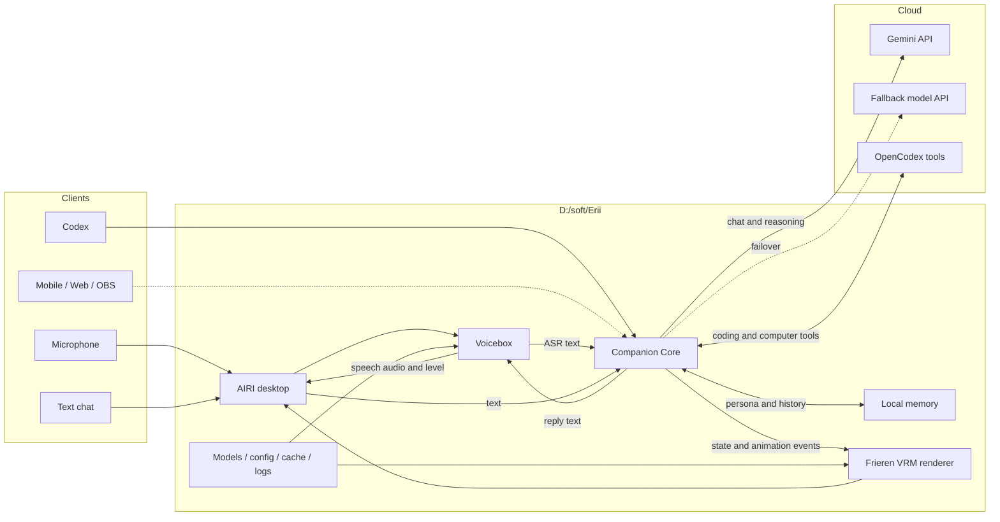

# Erii Runtime Design

## Goal

Erii is a reusable AI companion platform. The local application owns the avatar,
voice pipeline, memory, privacy boundary, and tool orchestration. Remote model APIs
provide the main reasoning capacity.

## Core Logic



## Runtime Boundary

- Gemini is the default conversational brain.
- OpenCodex is a tool and coding adapter, not the product boundary.
- Companion Core owns conversation lifecycle, interruption, provider routing,
  persona state, memory policy, and normalized avatar events.
- Voicebox owns ASR and TTS.
- AIRI owns the desktop shell and VRM presentation.
- The Frieren model remains local-only and must never enter Git history.

## Local Layout

```text
D:\soft\Erii\
|- apps\
|- packages\
|- assets\local\frieren\
|- models\voicebox\
|- data\
|- cache\
|- logs\
|- config\
`- scripts\
```

Mutable runtime directories and licensed avatar media are ignored by Git.

